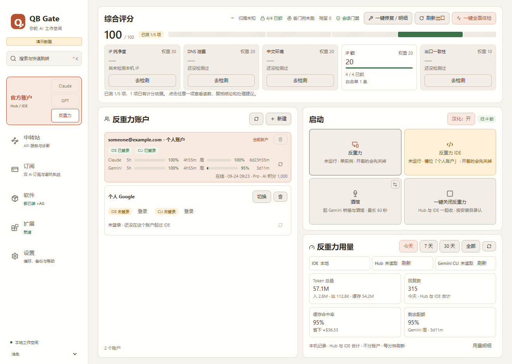
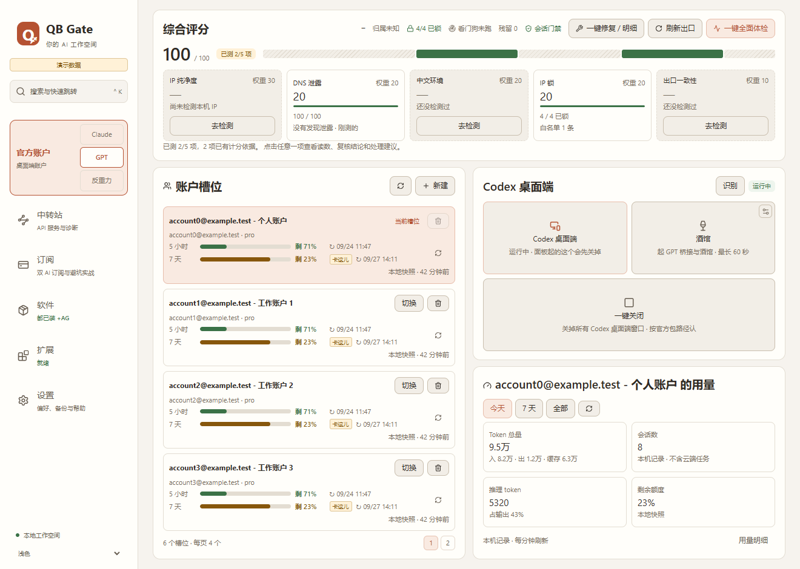
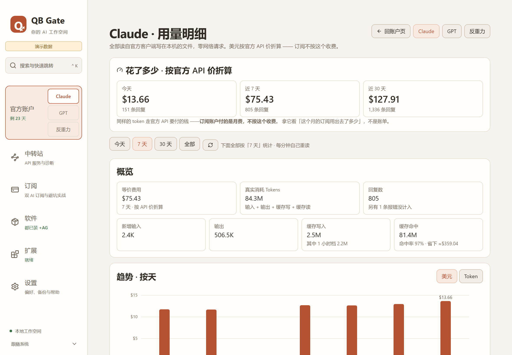
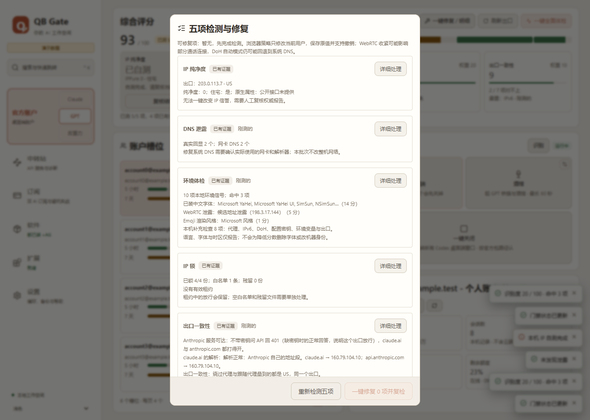

# QB Gate

[简体中文](README.md) | **English**

If your work makes you change IP addresses often, you have probably noticed this: when your network exit changes, the AI apps on your computer don't stop. They keep sending requests from an exit you never approved. QB Gate keeps an eye on that for you. **Claude, GPT (Codex) and Antigravity can only start while your exit IP is on a list you approved. If the IP changes or can't be checked while they run, QB Gate closes them right away.**

[](https://github.com/smithtaylor7748-ops/qb-gate/releases/latest/download/QB-Gate-Windows-x64-setup.exe)

- For Windows 10 / 11 x64. The interface is in Chinese.
- The installer is not code-signed yet, so Windows may show a SmartScreen warning. You can check the download against `SHA256SUMS.txt` on the [Releases](https://github.com/smithtaylor7748-ops/qb-gate/releases/latest) page.
- 🆕 Starting with 0.25.3, the panel checks GitHub for a newer version when it opens, shows a pop-up if there is one, and can install it with one click (see "How updates work" below). **If you have v0.24.8 or older, download and install this version by hand once**: older versions don't have the update check.

> ⚠ **Windows Security may quarantine it as a virus** (for example `Trojan:Win32/Bearfoos.A!ml`). This is a **false positive**: the `!ml` suffix means a machine-learning model guessed, not that an actual virus was found. What this panel does (locking other programs, closing processes based on your IP, downloading official installers and running them) looks a lot like malware behaviour, and it is unsigned with a new file every release, so it gets flagged. **How to restore it, add an exclusion and report the false positive to Microsoft** is in [docs/ANTIVIRUS.zh-CN.md](docs/ANTIVIRUS.zh-CN.md) (Chinese). Check the SHA-256 before restoring.

|                                                             |                                                           |
| ----------------------------------------------------------- | --------------------------------------------------------- |
|             |  |
| **Official accounts · Claude**: score, login slots, launch and usage | 🆕 **Official accounts · Antigravity**: Hub / IDE, slots and online quota |
|    |               |
| **Official accounts · GPT**: Codex desktop accounts and quota | 🆕 **Usage details**: what today / 7 days / 30 days are worth in USD |
|                    |  |
| **Software**: install, upgrade, roll back and fully uninstall | **Environment check**: five scores, fix things in place |

The screenshots show made-up demo data, not the state of any real machine. Items marked 🆕 are new or reworked since the previous public release, v0.24.8.

## What it does for you

### IP gate (the core)

- Add the exit IPs you approve to an allowlist (you can add country rules too). If your exit is not on the list, the AI apps under the gate can't start.
- While they run, a watchdog checks your exit every 5 seconds. If the IP changes, fails the rules or can't be checked, it locks up right away and closes the sessions the panel started. There is no grace period.
- Which apps are under the gate: Claude (Claude Code and the desktop app) always; 🆕 GPT (Codex) and Antigravity (Hub and IDE) by default too, and you can take them out under "IP lock".
- The in-session gate (checks the exit again before every request) is off by default; turn it on if you want it.
- Closing the panel window only hides it in the tray, so the gate keeps working. Quitting from the tray locks everything again.

### Official accounts: Claude, GPT and Antigravity

All three pages share one layout: the overall score on top, login slots on the left, launch buttons and usage on the right.

- **Login slots**: keep several of your own logins for the same app, shown as "email - name". Only you can switch them, by clicking, and only one is active at a time.
- **Launch and close all**: the exit IP is checked before anything starts. "Close all" only closes processes that really belong to these apps; it never kills by process name.
- **Quota**: Claude's 5-hour / 7-day quota is read from local files only. 🆕 GPT and Antigravity quotas also come from local records, and the official service is asked only when you click that row's refresh icon (one account at a time, no timers). The numbers are only displayed and never switch accounts automatically.
- 🆕 **Usage details**: what today, the last 7 days and the last 30 days would cost at official API prices in USD. This is **not a bill**, and subscriptions are not charged this way. There is also a daily bar chart and breakdowns by model, by account and by recent request. Fixed: usage cards stuck at 0, errors counted as replies, cache writes under-priced, and dates off by one day in UTC+8.
- 🆕 **GPT (Codex desktop)**: renamed to "GPT" in the sidebar. Starting or switching an account only closes the Codex window the panel opened itself and leaves others alone, so no more "a second window suddenly pops up". When a login token expires, it tells you plainly that opening the desktop app will renew it, instead of claiming you are logged out.
- 🆕 **Antigravity (Google Antigravity)**: a new page. Start and close Hub and IDE from here; keep several IDE login slots (one Google account each, and you log in inside the IDE's own window); see account tier, AI credits and the 5-hour / weekly quota for both the Claude and Gemini groups; and see how many tokens you used locally. Antigravity itself cannot go through relay stations.

### Environment check

- One click checks and scores five things: IP purity, DNS leaks, Chinese-environment signals, IP lock and exit consistency. Click any tile to see the details and fix it in place. "Disable IPv6 on this machine" in IP purity is on by default.
- 🆕 More accurate now:
  - tests whether Anthropic's service is reachable from your machine without sending any account credentials, so regional blocking shows up directly;
  - checks whether claude.ai resolves to a poisoned address;
  - recognizes PAC and TUN proxies, so it no longer says "system proxy is off" by mistake;
  - finds which country your IPv6 traffic really leaves from, instead of just checking whether IPv6 is on;
  - runs the Chinese-environment check in your usual default browser (it used to test the panel's built-in browser);
  - DNS leak scoring only looks at connected network adapters, so Wi-Fi-only machines are no longer penalized;
  - if any key check fails (for example the API is blocked, or IPv6 leaves from another country), the overall grade is capped at "deviation".

### Software: install, upgrade, uninstall

- **Managed install**: Claude Code and Codex CLI are downloaded from their official sources, checked against SHA-256 and digital signatures, and locked right after install. 🆕 The "Install / Upgrade" button used to spin forever; that is fixed.
- **Upgrade and roll back**: choose latest or stable; the last 3 versions are kept so you can go back at any time.
- 🆕 **Install the Codex desktop app without opening the Microsoft Store**: downloaded straight from Microsoft, with the hash and OpenAI's signature checked before installing.
- 🆕 **One-click install for Antigravity and Gemini CLI**: Antigravity's official installer is fetched from Google's own servers and its signature is checked first (the panel never redistributes or modifies it); Gemini CLI installs correctly now.
- **Full uninstall**: first lists everywhere the app lives on your computer; nothing happens until you type the confirmation word. 🆕 Codex desktop, Antigravity and Gemini CLI can be fully uninstalled too. There is also an uninstall prompt you can hand to another AI.
- **Google Chrome**: privacy audit (read-only), system proxy changes and a browser outbound lock (only when you click, and undoable), plus a full reinstall (deletes all browser data).

### Extensions

- 🆕 **Three SillyTavern bridges**: Claude (your own bridge.py), GPT (drives the official Codex CLI) and Gemini (drives the official Gemini CLI). Ports and models are set in the panel (the small button in the corner of the SillyTavern tile); the Claude bridge's settings and call log moved into the panel; and it lists what is still missing. A slow SillyTavern start (it reinstalls its dependencies every time) is no longer killed by mistake.
- 🆕 **Antigravity · localization and approvals**: Chinese interface, auto-approval and high-risk command blocking (with editable rules). It only injects a script into the interface and changes none of Antigravity's files.
- **MCP, Skills and configuration templates**: import, preview the differences, then install into the environment you choose; connection tests only run when you start them.

### Subscription guide

- Explains which Claude and ChatGPT plans are worth it and what to watch out for. 🆕 Plan quotas now use the median community estimates from a linux.do thread, and the "effective multiplier" is converted at 1 USD = 7 CNY so it compares on the same scale as relay stations.

### Relay stations

- Smart scheduling (beta): already visible in the interface, but not usable yet.

### Settings

- **General**: theme; re-open the gate automatically when the network recovers; turn off Claude Code's non-essential telemetry; align the system time zone and regional format with your exit IP at startup (on by default) and the display language (off by default).
- 🆕 **Software update**: check for a new version at startup (on by default, can be turned off) and a manual "Check for updates" button.
- **Backup and restore**, **Help and sources**, **Advanced maintenance** (move the managed-install folder, restore the system time zone).

## 🆕 How updates work

- **On 0.25.3 or newer**: when a new version is on GitHub, the panel shows a pop-up with what changed. Click 「一键更新」 (Update now) and the panel downloads the installer, checks it against `SHA256SUMS.txt` from the same release, then quits, installs and reopens by itself.
- **The panel quits during the update**: the Claude desktop app, conversations and SillyTavern it started are closed too, so save your work first. If now is not a good time, choose 「以后再说」 (Later) or 「跳过这个版本」 (Skip this version); you can also turn off the startup check in Settings.
- **On v0.24.8 or older**: those versions don't have this feature. Use the download button at the top of this page once.

## Compliance boundaries (please read)

- **No automatic account switching**: nothing switches accounts when a quota runs out, you get rate-limited or you see a 429. Only you can switch accounts, and **only one account is active at a time**.
- **Every account must legitimately belong to you.**
- **Quota is display-only**: Claude is read from local files only; GPT, Gemini CLI and Antigravity ask the official service only when you click the refresh icon, and nothing is decided automatically from the numbers.
- **No device-fingerprint changes, no identity spoofing, no built-in proxy or VPN**: it only controls which network exit your local AI apps run under.

## Disclaimer

Read the full [disclaimer (DISCLAIMER.md)](DISCLAIMER.md) before use; it has an English summary at the end. Key points:

- This is an unofficial project with no affiliation, partnership or endorsement from Anthropic, OpenAI, Google or any other provider.
- **No promises about account status.** The software only controls the AI apps on your own computer. It does not rewrite device fingerprints or disguise your identity, and it is not designed to (and cannot) get around any provider's security measures, compliance requirements, regional restrictions or bans.
- No proxy, VPN or censorship-circumvention features. You are responsible for whether your network access is legal.
- Use it only with accounts you legitimately own, and follow local law and each provider's terms.
- Some features change system settings (IPv6, time zone and regional format, firewall rules, system proxy and so on) or permanently delete data. Read the prompts before you confirm.
- Every place the panel goes online is listed in section 7 of the disclaimer. 🆕 That includes the startup update check, which only reads a small file from this project's GitHub releases, sends no account information, and can be turned off in Settings.

## QQ group

"门禁值班室" (Gate duty room): `1109462206`

Questions, install problems and feature ideas are all welcome there (Chinese-speaking). Before posting logs or screenshots, blur your exit IP, account email and tokens.

## License

This project is released under **AGPL-3.0-only**, with three additional terms under section 7 of the AGPL. The full terms are in
[LICENSE](LICENSE) and [LICENSE-ADDITIONAL-TERMS.md](LICENSE-ADDITIONAL-TERMS.md).

### If you modify it and distribute it

The AGPL itself requires you to include the license text, keep the copyright notices, state what you changed, and release the whole modified version under AGPL-3.0-only with its source code (running a modified version as a network service for others counts too, §13). The additional terms add three more requirements that recipients may not remove (AGPL §7):

1. **Keep the attribution and repository link.** The README (or an equivalent top-level file) of the source and the "About" screen of the interface must keep this notice unaltered:

   > Based on QB Gate, Copyright (C) 2026 smithtaylor7748-ops.
   > Source code: https://github.com/smithtaylor7748-ops/qb-gate

2. **Mark modified versions as modified**, and do not suggest they are published or endorsed by the original author.
3. **Do not call it "QB Gate".** The name and icon are not licensed; a modified version needs a different name (truthfully mentioning the original name in the attribution is fine).

If your modified version keeps the one-click update, point the update check at your own releases (`REPO` in `crates/qb-install/src/install/self_update.rs`). Otherwise your users will be "updated" back to the original.

For uses that do not follow the AGPL (combining it into closed-source software, or offering it as a service without publishing your changes), a separate license is needed; see [LICENSE-COMMERCIAL.md](LICENSE-COMMERCIAL.md).

### License notice

**This section is the formal notice.** The license fields in `Cargo.toml` / `package.json` are only hints for package managers and do not grant a license. Note that the wording does **not** say "or any later version": this project is licensed under version **3** of the AGPL only, and future versions published by the FSF do not apply automatically (AGPL §14).

```
QB Gate — Windows 本地 AI 客户端工作空间
Copyright (C) 2026 smithtaylor7748-ops

This program is free software: you can redistribute it and/or modify
it under the terms of the GNU Affero General Public License as published
by the Free Software Foundation, version 3, supplemented by the additional
terms permitted under section 7 of that license and set out in
LICENSE-ADDITIONAL-TERMS.md (preservation of attribution, marking of
modified versions, and no grant of the "QB Gate" name).

This program is distributed in the hope that it will be useful,
but WITHOUT ANY WARRANTY; without even the implied warranty of
MERCHANTABILITY or FITNESS FOR A PARTICULAR PURPOSE.  See the
GNU Affero General Public License for more details.

You should have received a copy of the GNU Affero General Public License
along with this program.  If not, see <https://www.gnu.org/licenses/>.
```

## Community

This project is promoted as open source in the [LINUX DO](https://linux.do/) community. Thanks to everyone there for the discussion, feedback and suggestions.
