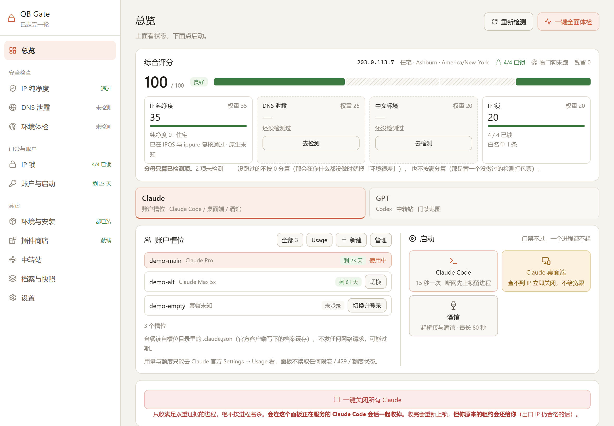
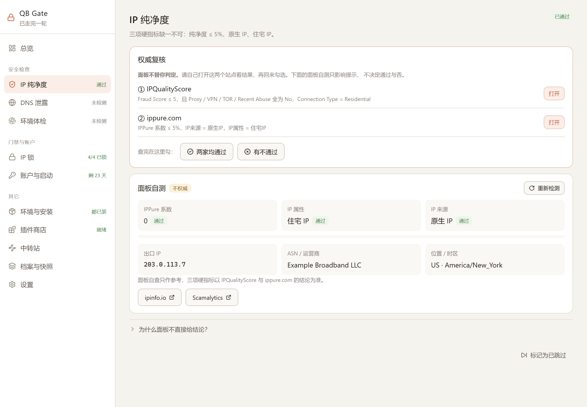
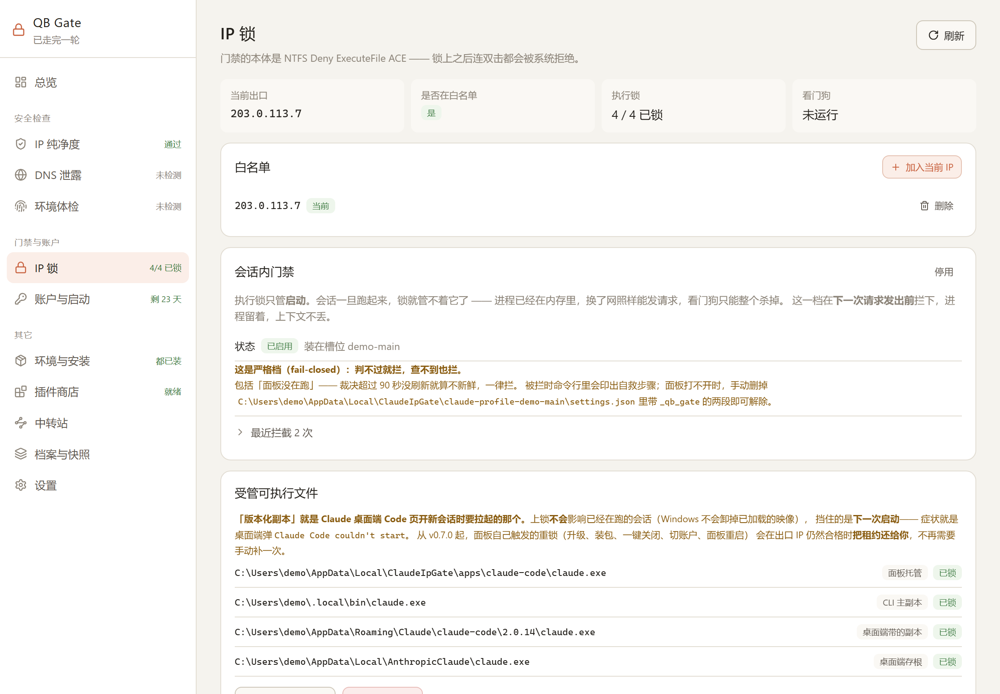
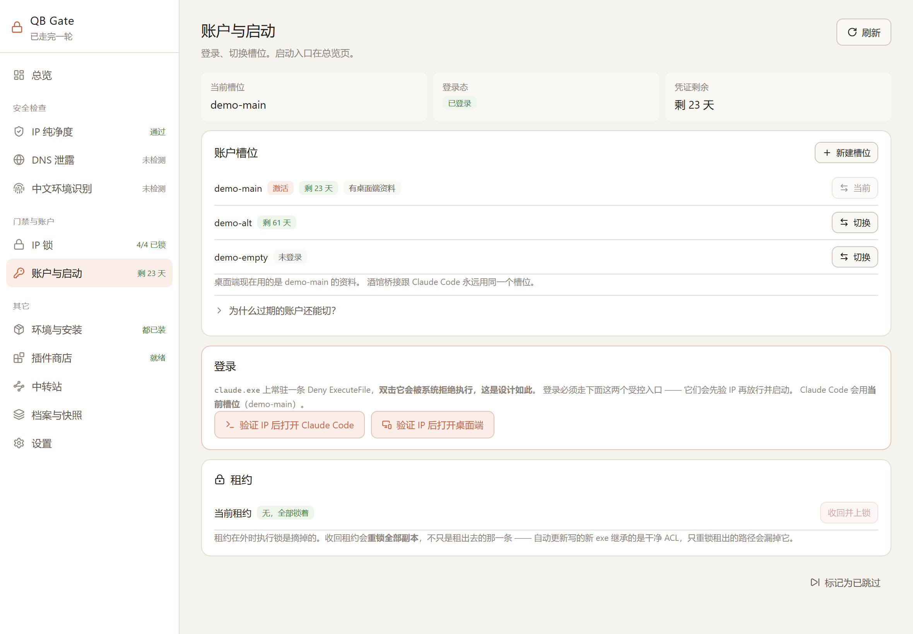
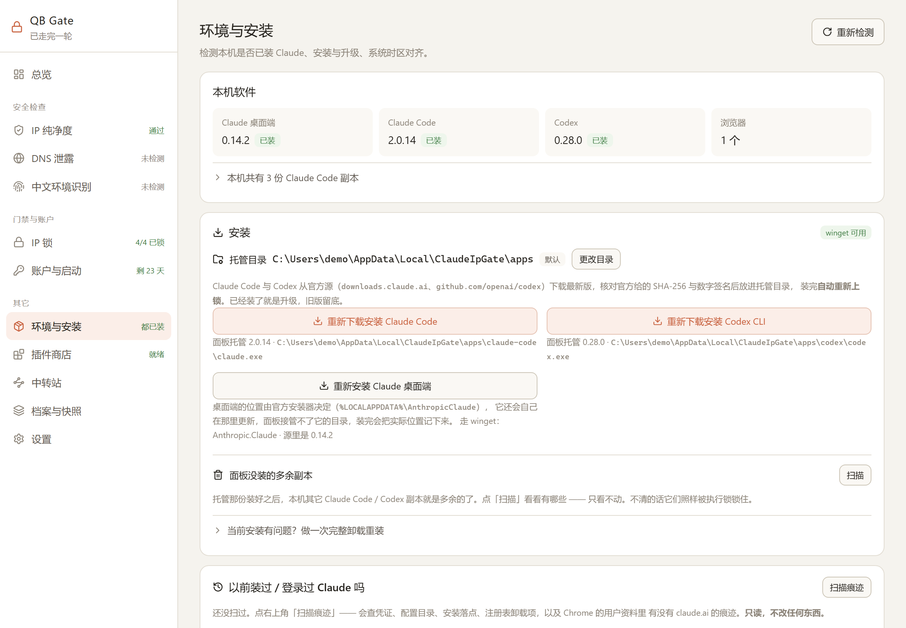
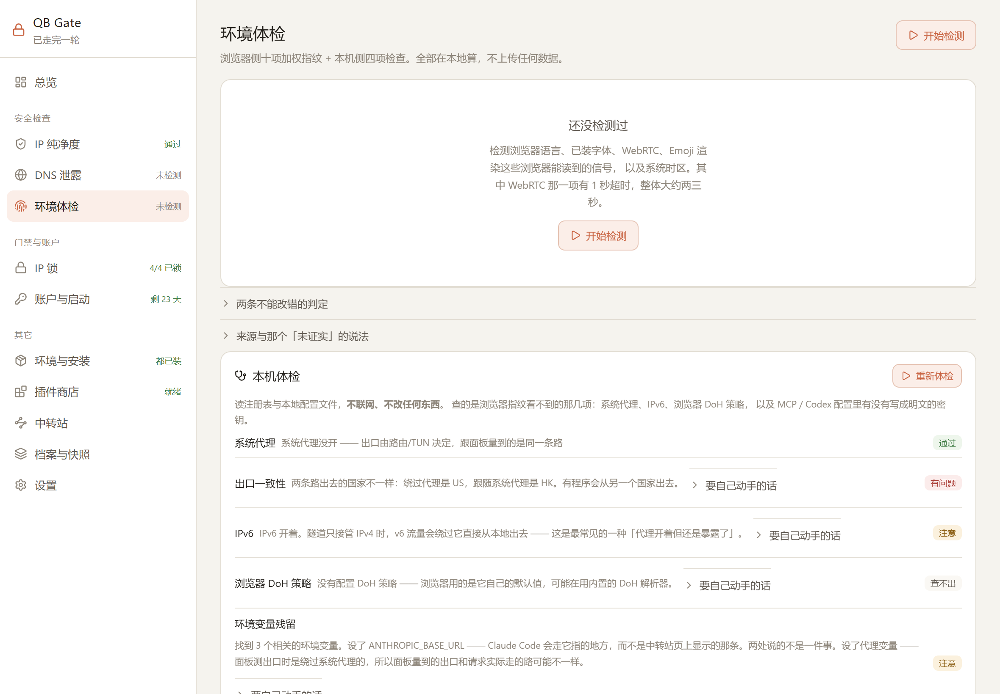

# QB Gate

给 Claude Code 与 Claude 桌面端准备的 Windows 运行环境控制面板。
把 IP 锁、纯净度复核、DNS 泄露检测、环境检测与安装、中转站配置、账户与启动收进一个界面。

Tauri 2 + React + Rust，GPL-3.0-or-later。

**完整开源、没有未开源的部分**：面板的全部源码都在这个仓库里 —— 没有闭源模块、
没有预编译二进制、也没有本项目自己的服务端；安装包由 GitHub Actions 从本仓库源码构建。

[](https://github.com/smithtaylor7748-ops/qb-gate/actions/workflows/ci.yml)
[![LINUX DO](https://img.shields.io/badge/LINUX-DO-FFB003.svg?logo=data:image/svg%2bxml;base64,DQo8c3ZnIHhtbG5zPSJodHRwOi8vd3d3LnczLm9yZy8yMDAwL3N2ZyIgd2lkdGg9IjEwMCIgaGVpZ2h0PSIxMDAiPjxwYXRoIGQ9Ik00Ni44Mi0uMDU1aDYuMjVxMjMuOTY5IDIuMDYyIDM4IDIxLjQyNmM1LjI1OCA3LjY3NiA4LjIxNSAxNi4xNTYgOC44NzUgMjUuNDV2Ni4yNXEtMi4wNjQgMjMuOTY4LTIxLjQzIDM4LTExLjUxMiA3Ljg4NS0yNS40NDUgOC44NzRoLTYuMjVxLTIzLjk3LTIuMDY0LTM4LjAwNC0yMS40M1EuOTcxIDY3LjA1Ni0uMDU0IDUzLjE4di02LjQ3M0MxLjM2MiAzMC43ODEgOC41MDMgMTguMTQ4IDIxLjM3IDguODE3IDI5LjA0NyAzLjU2MiAzNy41MjcuNjA0IDQ2LjgyMS0uMDU2IiBzdHlsZT0ic3Ryb2tlOm5vbmU7ZmlsbC1ydWxlOmV2ZW5vZGQ7ZmlsbDojZWNlY2VjO2ZpbGwtb3BhY2l0eToxIi8+PHBhdGggZD0iTTQ3LjI2NiAyLjk1N3EyMi41My0uNjUgMzcuNzc3IDE1LjczOGE0OS43IDQ5LjcgMCAwIDEgNi44NjcgMTAuMTU3cS00MS45NjQuMjIyLTgzLjkzIDAgOS43NS0xOC42MTYgMzAuMDI0LTI0LjM4N2E2MSA2MSAwIDAgMSA5LjI2Mi0xLjUwOCIgc3R5bGU9InN0cm9rZTpub25lO2ZpbGwtcnVsZTpldmVub2RkO2ZpbGw6IzE5MTkxOTtmaWxsLW9wYWNpdHk6MSIvPjxwYXRoIGQ9Ik03Ljk4IDcwLjkyNmMyNy45NzctLjAzNSA1NS45NTQgMCA4My45My4xMTNRODMuNDI2IDg3LjQ3MyA2Ni4xMyA5NC4wODZxLTE4LjgxIDYuNTQ0LTM2LjgzMi0xLjg5OC0xNC4yMDMtNy4wOS0yMS4zMTctMjEuMjYyIiBzdHlsZT0ic3Ryb2tlOm5vbmU7ZmlsbC1ydWxlOmV2ZW5vZGQ7ZmlsbDojZjlhZjAwO2ZpbGwtb3BhY2l0eToxIi8+PC9zdmc+)](https://linux.do)

---

## 下载

**[⬇ 到 Releases 页面下载最新安装包](https://github.com/smithtaylor7748-ops/qb-gate/releases/latest)**
（`QB Gate_<版本>_x64-setup.exe`，约 2 MB，Windows 10 / 11 x64）

装完桌面会有快捷方式，直接双击打开面板。卸载走「设置 → 应用」里的正常卸载。

> **⚠ 安装包没有代码签名证书**，Windows 会弹 SmartScreen 蓝框
> 「Windows 已保护你的电脑」。这不代表文件有问题，是因为个人项目买不起
> （也没必要买）EV 证书。要继续的话点「更多信息 → 仍要运行」。
>
> **不放心就别点。** 两个更稳的办法：
> 1. 核对 SHA-256 —— 每次发布的哈希写在对应的 Release 页面上；
> 2. [自己从源码构建](#构建)，几条命令的事。
>
> 安装包由 GitHub Actions 在干净的 Windows runner 上从本仓库源码构建，
> 构建过程在 [Actions](https://github.com/smithtaylor7748-ops/qb-gate/actions) 里公开可查。

---

> ### ⚠ 使用前必读：[免责声明 DISCLAIMER.md](DISCLAIMER.md)
>
> - **非官方项目，与 Anthropic PBC 没有任何隶属、合作或背书关系。**
>   "Claude"、"Anthropic"、"Codex"、"OpenAI" 等商标归各自权利人所有，
>   本文档中提到它们只为说明本工具与哪些软件配合使用，不代表取得任何授权。
> - **不承诺「防封」。** 面板所有检测都是基于公开接口的参考性判断，
>   不等于任何服务商的实际判定，不构成安全保证。
> - **不含任何代理 / VPN / 翻墙功能**，只读取并展示你已有网络环境的状态。
>   网络接入是否合法由使用者自行负责。
> - **所有账户必须是使用者本人拥有的。** 不得用于规避限流、规避封禁、
>   账号共享或买卖。
> - **部分操作不可逆。** 尤其「Chrome 清空重装」会**永久删除**整个
>   Chrome `User Data`（书签、密码、扩展、全部登录态），执行前请先备份。
> - **本项目不是安全边界**，存在已知绕过路径，别当强制访问控制用。
>
> **This is an unofficial, independent project, not affiliated with or endorsed by
> Anthropic. Provided AS IS with no warranty. It does not prevent account bans and
> contains no VPN/proxy functionality. Some operations permanently delete data.
> See [DISCLAIMER.md](DISCLAIMER.md) before use.**

---

## 它解决什么

在 VPN 后面用 Claude，有一串琐碎但要命的事：出口 IP 变了没人拦、DNS 悄悄
从物理网卡漏出去、系统时区跟 IP 对不上、装了一半的旧版本残留一个没上锁的
可执行副本。这些原本散在十几个 .ps1 / .cmd 里，只有写脚本的人自己会用。

这个面板把它们收成一个界面，并且**把踩过的坑固化成回归测试** ——
移植时最容易丢的恰恰是那些看起来多余的分支。

---

## 长什么样



侧栏按功能分组，**不是**一条从上走到下的向导：总览在最上面，下面是「安全检查」
「门禁与账户」「其它」。随便点哪一页都行，每行右侧只报当前状态 ——
`4/4 已锁`、`剩 23 天`、`通过`。

五项检查照样各自记账。哪一项没走过、哪一项是**知情跳过**的，总览顶上那条横幅里写着：

| 检查项 | 做什么 |
|---|---|
| IP 纯净度 | 三项硬指标复核，不合格整个面板爆红 |
| 环境与安装 | 检测、托管安装 Claude Code / Codex、清外部副本、时区对齐、中文环境识别 |
| DNS 泄露 | 简易通过（真实解析回显）与高级通过（交给 Codex） |
| IP 锁 | 白名单、执行锁、看门狗 |
| 账户与启动 | 登录、切换槽位、验证 IP 后启动 |

**每一项都能强制跳过**，但跳过会记账，总览上显示「跳过 N 项」，不让它变成静默的坑。

| | |
|---|---|
|  |  |
| **IP 纯净度** —— 权威判定交给你自己看，面板只给自测并标明不权威 | **IP 锁** —— 白名单、每一份副本的锁状态、看门狗 |
|  |  |
| **账户与启动** —— 槽位、凭证剩余天数、受控登录入口 | **环境与安装** —— 本机副本盘点、托管安装、托管目录迁移 |

> **图里全是演示数据**，不是任何真实机器的状态：出口 IP 用 RFC 5737 的文档保留段、
> 路径是 `C:\Users\demo\`、账户是编造的槽位名。
> 自己跑一遍：`npm run demo`（见[构建](#构建)）。数据来自 `src/lib/demo.ts`，
> 这条分支只在 `VITE_DEMO=1` 时存在，安装包里没有。

---

## IP 锁是怎么锁的

门禁的本体不是脚本里的 if 判断，是 NTFS ACL：给 `claude.exe` 加一条针对
**当前用户**的 `Deny ExecuteFile` ACE。锁上之后连双击都会被系统拒绝执行。

所以**登录必须走面板里的受控入口**，不能叫人去双击 exe —— 那会被系统拒绝，
这是设计如此。

出口 IP 回到白名单内，面板解锁并放行；离开白名单，看门狗自动重新上锁。
几条不显然但很贵的设计（分开处理「查不到 IP」和「IP 变了」、桌面端不给宽限、
租约被收走要自己要回来等）写在 [实现笔记](docs/DESIGN-NOTES.zh-CN.md)。

### 要锁哪些文件

**每一个完整可执行的 `claude.exe` 副本都必须锁上。漏掉一个，那一个就是现成的绕过入口。**

「Claude 装在哪」全项目只有一张表：`src-tauri/src/install/inventory.rs`。
检测、启动、上锁、升级、残留清理都从它拿。

| 来源 | 位置 | 锁 | 拿来启动 |
|---|---|:--:|:--:|
| **面板托管** | `<托管目录>\claude-code\claude.exe`，默认 `%LOCALAPPDATA%\ClaudeIpGate\apps` | ✅ | 第 1 选择 |
| 官方安装器 | `~\.local\bin\claude.exe` | ✅ | 第 2 |
| 安装器版本库 | `~\.local\share\claude\versions\<版本>`（**是文件**，每个都是完整二进制） | ✅ | — |
| 安装器下载缓存 | `~\.claude\downloads\claude-*.exe`（实测一份 218 MB） | ✅ | — |
| winget | `%LOCALAPPDATA%` / `%ProgramFiles%` 下的 `WinGet\Packages\Anthropic.ClaudeCode*` 与 `WinGet\Links` | ✅ | 第 3 |
| Scoop | `~\scoop\apps\claude-code\…` | ✅ | 第 4 |
| 旧脚本认的位置 | `%LOCALAPPDATA%\Programs\Claude\claude.exe` | ✅ | 第 5 |
| PATH 上的 | 任何不在上面几处、但在 `PATH` 里的 `claude.exe` | ✅ | 第 6 |
| 桌面端带的 | `%APPDATA%\Claude*\claude-code\<版本>\claude.exe`（每个资料目录、每个版本） | ✅ | 第 7 |
| npm | `%APPDATA%\npm\claude.cmd` | ❌ 见下 | 最后 |
| 编辑器扩展 | VS Code / Cursor / Windsurf 的 `anthropic.claude-code-*` 扩展里自带的 | ✅ | — |
| 桌面端存根 | `%LOCALAPPDATA%\AnthropicClaude\claude.exe` | ✅ | （启动桌面端） |
| 桌面端运行时 | `%LOCALAPPDATA%\AnthropicClaude\app-<版本>\claude.exe` | **不锁** | — |

环境页会把本机找到的全部副本列出来，标明哪份拿来启动、哪份锁得上。

### 已知缺口

执行锁挡得住「正常的那条路」，挡不住绕开它的路：`app-<版本>` 下那份不能加 Deny ACE，
npm 装的批处理挡不住直接调内部 node 脚本，MSIX 版桌面端改不了 ACL。
逐条说明与其它待修项见 [已知问题](docs/KNOWN-ISSUES.zh-CN.md)。

> **本项目提供的不是安全边界，不要把它当强制访问控制使用。**
> 真正的强制执行需要 AppLocker / WDAC，不在本项目范围内。

---

## 三层门禁，管的是三件不同的事

执行锁只管**启动**。会话一旦跑起来，锁就管不着它了 —— 进程已经在内存里，
换了网照样能发请求。所以门禁是三层，各守各的：

| 层 | 守什么 | 判不过怎么办 | 默认 |
|---|---|---|---|
| **执行锁（NTFS ACL）** | 下一次启动 | 系统直接拒绝执行 | 开 |
| **看门狗**（15 / 20 秒一轮） | 正在跑的进程 | 上锁 + 收进程，**第一轮就收，没有宽限期** | 跟着租约 |
| **会话内门禁**（Claude Code hook） | 每一次请求 | 拦下这一次，进程留着，上下文不丢 | **关** |

中间那一档原来是空的：IP 变了只能靠看门狗 `taskkill` 硬杀，未保存的对话跟着没。

> ⚠ **看门狗没有宽限期。** 出口 IP 不在白名单、国家不合格、或者三个探测源全都
> 答不上来 —— 三种情况都是**第一轮就上锁 + 关闭全部 Claude 进程**。
> 这是刻意选的严格档，代价是网络抖一下就会丢掉没保存的对话，
> 详见 [DISCLAIMER 第 4.5 节](DISCLAIMER.md)。

### 会话内门禁

面板生成一个 hook 脚本，挂进当前槽位的 `settings.json`（`SessionStart` 与
`UserPromptSubmit` 各一条，带 `_qb_gate` 自标记，卸载时只删自己那两条，
**使用者自己配的 hook 一条不动**）。

脚本里**一行判定逻辑都没有** —— 只读面板落下的 `gate-verdict.json`。
在 PowerShell 里再写一遍白名单比对，就是「在别处再拼一份」，两份迟早对不上，
而对不上的那一边就是绕过入口。

它是**严格档（fail-closed）**：判不过拦、查不到拦、**面板没在跑也拦**
（裁决超过 90 秒没刷新就算不新鲜）。代价与三条自救路径写在
[DISCLAIMER 第 4.5 节](DISCLAIMER.md)。白名单为空时面板**拒绝启用**这一项。

### 国家白名单

只有 IP 白名单是不够的：白名单里那条记录一个字没动，它归属的国家可能已经变了
（GeoIP 库更新、ASN 转手、机房搬迁）。

开了这一层之后，**国家不合格 = 不合格**，跟 IP 不在白名单一个待遇。两处强制：

1. **加 IP 进白名单之前先验国家** —— 不合格一个字都不写。堵的是「先把脏 IP
   塞进白名单，再回头抱怨门禁没用」；
2. **每一轮判定都带国家** —— 看门狗、hook、手动放行三处共用同一个判定函数
   （`gate/judge.rs`）。三处各判一份，漏掉国家那一维的那一处就是绕过入口。

**名单为空 = 这一层不启用，不是全拒**（全拒会在你还没配置时就把你关在门外）。
查不到国家、或者几个探测源报的国家互相打架，一律按不合格处理，
冲突原文写进日志 —— 不记的话这种误杀事后根本查不出来。

出口探测因此改成了**三源并发**（ippure / Cloudflare / ipinfo），任一家答上来
就算查到。fail-closed 之下单一数据源的可用性等于你的可用性，
这不是放宽判定口径，是让「查不到」真的只在三家全挂时才成立。

---

## 中转站：它背后到底是谁

你买的那条「Claude 官方」，背后可能是三样东西之一 —— 响应格式一模一样，
肉眼没有任何差别：

| 后端 | 谁在这么干 |
|---|---|
| Anthropic | 官方 API Key、Max 订阅转发 |
| AWS Bedrock | Kiro 逆向 |
| Google Vertex | Antigravity 逆向 |

中转站页每条供应商有个「验后端」按钮：真发一次 `/v1/messages`（`max_tokens=1`），
看响应头指纹、**缺字段负证据**（回的是 Claude 格式却一个 `anthropic-*` 头都没有
—— 转换层做得出响应体，造不出上游本来没有的头），再连发两次看限流计数是不是
真的在动。

**证据不足就报「说不准」，不猜。** 每条证据都原样列出来 ——
只给结论的话，你没法复核，也就没法拿去问对方。

⚠ 它会把 Key 发到你填的那个地址上，而且**真的消耗一点点额度**，
所以只有你点了才跑，也没有「全部检测」那种批量入口。

---

## 纯净度：面板不替你判定

三项硬指标缺一不可：**纯净度 ≤ 5%**、**原生 IP**、**住宅 IP**。

权威判定交给你自己看这两家，面板给一键跳转并把通过标准写在界面上：

- **IPQualityScore** — Fraud Score ≤ 5，且 Proxy / VPN / TOR / Recent Abuse
  全部为 No，且 Connection Type = Residential
- **ippure.com** — IPPure 系数 ≤ 5%，且 IP来源 = 原生IP，且 IP属性 = 住宅IP

面板自己也查（走 `https://my.ippure.com/v1/info`，公开无 Key），但界面上
明确标注**不权威**，且拿不到的字段**如实报「未知」，不猜成通过**。

---

## DNS 泄露

**简易通过**两条腿走路：

1. 真实解析回显 —— 向 bash.ws 取测试 id，依次解析 10 个探针域名，
   由它的权威域名服务器回报「是谁来查的」
2. 网卡配置检查 —— 看有没有「物理网卡 DNS 指向内网路由器」

**高级通过**交给 Codex 跑内置提示词：读网卡配置、路由表、系统代理、
浏览器 DoH，必要时用 PktMon 抓包核实，发现问题给出修复方案。
建议配高级模型 —— 这一条要读网络配置并做判断，弱模型容易给出
看似合理但错误的结论。

---

## 账户槽位

一个槽位是一个独立的登录目录。面板启动 Claude Code 时把 `CLAUDE_CONFIG_DIR`
设成**当前槽位的具体目录**，所以每个槽位有自己的一套登录、设置和历史。

| 谁在用 | 「当前」由谁决定 | 槽位本体 |
|---|---|---|
| Claude Code（从面板启动的） | `%LOCALAPPDATA%\ClaudeIpGate\claude-profile` 联结点 | `%LOCALAPPDATA%\ClaudeIpGate\claude-profile-<标签>` |
| 酒馆桥接（装了才有） | `%LOCALAPPDATA%\ClaudeTavernBridge\claude-profile` 联结点 | **同一个目录** |
| 桌面端（可选） | `%APPDATA%\Claude` 联结点 | `%APPDATA%\Claude-<标签>` |

- **新建槽位是空的**，不从任何地方复制凭证（原因见[实现笔记](docs/DESIGN-NOTES.zh-CN.md)）。
  在新槽位里登录一次即可。一个槽位都没有时，Claude Code 用它自己的默认目录 `~\.claude`。
- **切换 = 先关闭全部 Claude，再换指向，不自动启动任何东西。**
  桌面端、所有 Claude Code 会话、酒馆桥接都关掉（走[一键关闭](#一键关闭)那套证据，
  **未保存的对话会丢**），然后三处指向一起换，要么全换要么都不换。
  **清场失败就不切**，槽位一点不动。托盘菜单里点另一个账户也是直接这样切，不弹框。

---

## 安装 Claude

**Claude Code 和 Codex 由面板装进它自己管的目录**，桌面端照官方位置装：

| 软件 | 装到 | 从哪下 | 校验（任何一条不过就不装） |
|---|---|---|---|
| Claude Code | `<托管目录>\claude-code\claude.exe` | `downloads.claude.ai/claude-code-releases`（官方安装脚本用的同一处） | 官方 `manifest.json` 里的 SHA-256 + Authenticode 主体含 Anthropic |
| Codex | `<托管目录>\codex\codex.exe`，连同压缩包里的两个辅助程序 | GitHub `openai/codex` 的最新 Release，地址钉死在这个仓库下 | Release 给的 SHA-256 摘要 + Authenticode 主体含 OpenAI |
| Claude 桌面端 | 官方位置 `%LOCALAPPDATA%\AnthropicClaude` | `winget install --id Anthropic.Claude -e` | winget 自己校验；装完再核一次签名 |

托管目录默认 `%LOCALAPPDATA%\ClaudeIpGate\apps`，安装确认框、环境页、设置页都能改，
**已经装好的会一键搬过去**。选目录时会在里面放一个探针文件当场实测锁不锁得住 ——
exFAT / FAT32、`Program Files`、网络盘当场拒绝，不会「装进去之后才发现锁不上」。
迁移要么全搬过去要么全留在原处，中途搬不动的会整体回滚。

托管那份装好之后，环境页能扫出本机多余的副本，由你决定**彻底清掉**还是**保留**
（保留的照样被执行锁锁住）。账户凭证、桌面端、编辑器扩展里的副本**永远不碰**。

为什么接管目录、为什么不用 winget 的 `--location`、完整性校验怎么做的，
见[实现笔记](docs/DESIGN-NOTES.zh-CN.md)。

---

## 插件商店

侧栏「随时可开」里。清单驱动（`src/plugins/registry.ts`），现在是内置数组。
官方清单仓库尚未创建前，商店保持「仅内置插件」模式，不接受任意下载地址。
启用远程清单时必须通过签名校验，并提供来源、许可证和文件哈希。

### 酒馆 SillyTavern

启动**真正的** SillyTavern 与 Claude 桥接 —— 世界书、角色卡、群聊、扩展
全部原样具备，面板不重写它的界面。面板负责的是 IP 门禁、启停、依赖检查、
以及资产的盘点与备份恢复。

**三个路径默认是空的，装上之后要自己填**（插件商店 → 酒馆 → 配置）：
SillyTavern 根目录、桥接根目录（含 `bridge.py`）、启动脚本。
填之前插件如实停在「依赖不齐」，不会假装能跑。
面板**不分发** SillyTavern 与 `bridge.py`，只在你已自行安装的前提下启动它们。

资产备份是**目录复制**不是打包：出问题时可以直接进文件夹翻，不需要本程序也能恢复。

---

## 一键关闭

只收满足证据的进程，三条之一：

1. 可执行文件由 Anthropic 签名；
2. 命令行**同时**命中 `bridge.py` 与本项目数据目录；
3. 进程是 `node.exe`，**并且**命令行指进 `node_modules\@anthropic-ai\claude-code\`
   —— npm 装的 Claude Code（`node.exe` 是 OpenJS 签名的，第 1 条永远认不出它）。

**绝不按进程名杀** —— 叫 `claude.exe`、`python.exe`、`node.exe` 的东西可能是你正在干的别的活。
面板自己和它的祖先进程一律放过。枚举失败会报错，不会退化成「0 个进程」。收完自动重新上锁。

切换账户、清外部副本、迁移托管目录用的都是这一套。

---

## 升级

默认走 `latest` 渠道。写死 `stable` 会导致降级（实测 stable 可能比本机还旧），
面板会直接拦下并说明原因。

装了面板托管的 Claude Code，升级就升那一份：同样先比版本、同样拦降级，
再走[托管安装](#安装-claude)那条下载 + 校验。旧版本改名留底为
`claude.exe.old.<时间>` 并单独加上执行锁，下次安装时清掉。

### 版本库与一键回滚

每次升级都把旧版本收进 `<托管根>\claude-code\versions\<版本>\`，默认留 3 份。
新版本有问题时可以直接退回去。

在这之前只留一个 `claude.exe.old.<时间戳>`，下次安装一把删 —— 名字里没有版本号，
装第二次上一版就永远没了。能往前走却退不回来，等于每次升级都是单程票。

- 回滚顺序是**先把当前这份收进库，再把目标版本换上来**（反过来中间那一刻两头空）；
- 从库里**拷不是移** —— 退回去之后还要能再退回来；
- **版本库里每一份都照样上锁**：它们是完整可执行的 `claude.exe`，
  漏一个就是现成的绕过入口。清外部副本永远不碰版本库；
- 回滚**不影响正在跑的会话**（Windows 不卸已加载的映像），下次启动才生效。

QB Gate 自身**不做自动更新**：启动时不联网检查，也不会自己下载任何东西。
要升级就自己来 [Releases](https://github.com/smithtaylor7748-ops/qb-gate/releases) 下新版本装上。

---

## 环境体检

**浏览器侧**十项加权指纹，满分 100，全部在本地计算、不上传任何数据。
逻辑改编自 [FuckClaude](https://github.com/LinXiaoTao/FuckClaude)（MIT）。

**本机侧**四项，查的是浏览器指纹看不到的东西：系统代理、IPv6、浏览器 DoH 策略，
以及 **MCP / Codex 配置里有没有写成明文的密钥**。读注册表与本地文件，
不联网、不改任何东西。

> 密钥扫描**只报位置，不报内容** —— 结构上就装不下密钥值。
> 报出来的东西迟早会被打进日志、截图或者贴进 issue，所以不是靠「记得别打印」，
> 是让它根本拿不到。



本机侧那几项**没有「一键修复」按钮**，给的是原样可复制的命令加代价说明。
关系统代理会当场断网、关 IPv6 要管理员权限加重启、改 DoH 是动整机的企业策略 ——
面板不做那种「点一下，然后你发现自己上不了网」的按钮。

面板对「能不能修」如实标注。**中文字体那 14 分修不掉** ——
删掉系统中文字体会让中文显示整体崩坏，代价远大于收益，
所以面板只报告，不提供「修复」按钮，也不假装能修。

台湾（`Asia/Taipei`、`zh-TW`）是 Anthropic 完整支持的地区，**故意不计分**；
港澳属受限地区，保留部分风险分。

---

## 构建

需要 Node 18+ 与 Rust 工具链。

```bash
npm install
npm run tauri dev      # 开发
npm run tauri build    # 出安装包
npm run demo           # 只跑界面，喂演示数据（上面那几张图就是这么拍的）
```

`npm run demo` 起的是纯前端：所有后端调用都被 `src/lib/demo.ts` 里编造的那份数据接走，
不碰 ACL、不碰进程、不读你的任何配置。重拍那几张图：`node scripts/screenshots.mjs`。

没装 Rust 的话：

```bash
winget install Rustlang.Rustup
```

Rust 侧单测（不联网、不动真 ACL、不碰真进程、不写运行期状态文件）：

```bash
cd src-tauri && cargo test
```

安装包产出在 `src-tauri/target/release/bundle/nsis/`。

---

## 合规边界

以下四条是硬约束，任何改动都不得破坏：

1. **不读取任何限流 / 429 / 额度状态**，不存在「用完自动换号」的路径
2. 账户切换只能由人手动触发，无定时器、无 watchdog、无自动调用点
3. 任意时刻只有一个账户激活
4. **所有账户必须是使用者本人拥有的**

总览的账户卡显示每个槽位的**套餐、计费方式、登录状态与凭证剩余天数**，
用量仍然只能去 Claude 官方 `Settings → Usage` 页面看。

**套餐是读文件读出来的，不是查接口查出来的。** 每个槽位目录里都有一份
`.claude.json`，其中的 `oauthAccount` 是官方客户端自己写下的档案缓存。
QB Gate 只读这个本地文件 —— 不发任何网络请求，不读用量、额度、429 或 OAuth 内部接口，
也**不显示** `organizationRateLimitTier` / `userRateLimitTier` 这两个字段。

Codex **默认不在 IP 门禁的管辖范围内**，可以在「设置 → 门禁范围」里打开。
默认关闭是刻意的 —— 这个开关会让一个正在用的命令突然跑不起来，
必须由使用者自己决定什么时候打开。

卸载清理功能的定位是：**修复损坏安装、移交机器、清除本人数据。**
不为规避封禁或用量限制而设计 —— Anthropic 政策禁止为规避限制而创建或轮换多个账户。

关于「Claude Code 用 Unicode 隐写术编码中国用户特征」的说法：
这是**第三方逆向分析主张，本项目未做独立验证**，界面上引用时标注了来源与未证实状态。

---

## 社区与反馈

这个项目从 **[LINUX DO](https://linux.do)** 起步，发布和更新也在那边 ——
谢谢愿意在自己机器上实机试、愿意把报错原样截图贴出来的佬友，
README 里那些「不显然但很贵」的分支，多半是这么来的。

想报 bug、提功能、问「装不上怎么办」，两条路：

| 去哪 | 适合什么 |
|---|---|
| [GitHub Issues](https://github.com/smithtaylor7748-ops/qb-gate/issues) | 能复现的 bug、功能提案 —— 有编号、能追溯、修完对得上版本 |
| **QQ 群「门禁值班室」**：`1109462206` | 还说不清的现场问题、装不上、想法没成形时先聊两句 |

群里聊明白的问题**最后还是要落一条 Issue** —— 聊天记录会被刷上去，Issue 不会。

贴日志和截图之前，**把出口 IP、账户邮箱、Token 打码**：纯净度页和账户卡上
就是你的真实信息。

---

## 文档

| | |
|---|---|
| [DISCLAIMER.md](DISCLAIMER.md) | 免责声明。**使用前必读**，里面写清楚了哪些操作不可逆 |
| [ATTRIBUTION.md](ATTRIBUTION.md) | 第三方来源与许可，逐条说明抄了什么、没抄什么 |
| [CLAUDE.md](CLAUDE.md) | **改这个仓库之前先读**：收工清单、不许加的功能、抄代码前的 license 规矩 |
| [docs/DESIGN-NOTES.zh-CN.md](docs/DESIGN-NOTES.zh-CN.md) | 实现笔记：为什么这么写。改代码前先读 |
| [docs/KNOWN-ISSUES.zh-CN.md](docs/KNOWN-ISSUES.zh-CN.md) | 已知问题、修不了的缺口、没实机验证过的路径 |

---

## 来源与致谢

检测部分大量参考已有开源实现，逐条列在 [ATTRIBUTION.md](ATTRIBUTION.md)：
抄了代码的、只用了公开接口的、以及看过但没采用的，都分开说明。

主要来源：[FuckClaude](https://github.com/LinXiaoTao/FuckClaude)（MIT，中文环境识别）、
[cc-switch](https://github.com/farion1231/cc-switch)（MIT，中转站配置形态）、
[bash.ws](https://bash.ws/dnsleak)（DNS 回显接口）、
[ippure.com](https://ippure.com/)（纯净度口径与公开接口）。

---

## 许可

**GNU General Public License v3.0 or later**（GPL-3.0-or-later），全文见 [LICENSE](LICENSE)。

```
Copyright (C) 2026 QB Gate contributors

本程序是自由软件：你可以依据自由软件基金会发布的 GNU 通用公共许可证
（第 3 版，或你选择的任一更新版本）的条款，重新发布和／或修改它。

发布本程序是希望它能派上用场，但**不作任何担保**；甚至不含对
适销性或特定用途适用性的默示担保。详见 GNU 通用公共许可证。

你应当已随本程序收到一份 GNU 通用公共许可证的副本。
如果没有，请见 <https://www.gnu.org/licenses/>。
```

一句话版本：**你可以自由使用、修改、再分发；但把改过的版本分发出去时，
也必须以 GPL-3.0 开放源码。**

上游那几个来源（FuckClaude、cc-switch、Tailwind、lucide-react）都是 MIT，
与 GPL-3.0 相容，版权声明按要求保留在对应文件里。
SillyTavern 是 AGPL-3.0，本项目只把它当独立进程启动，未复制未修改未链接。
