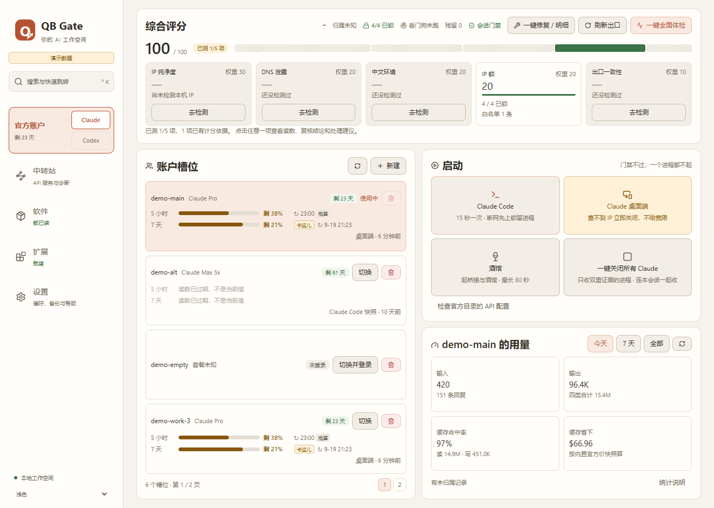
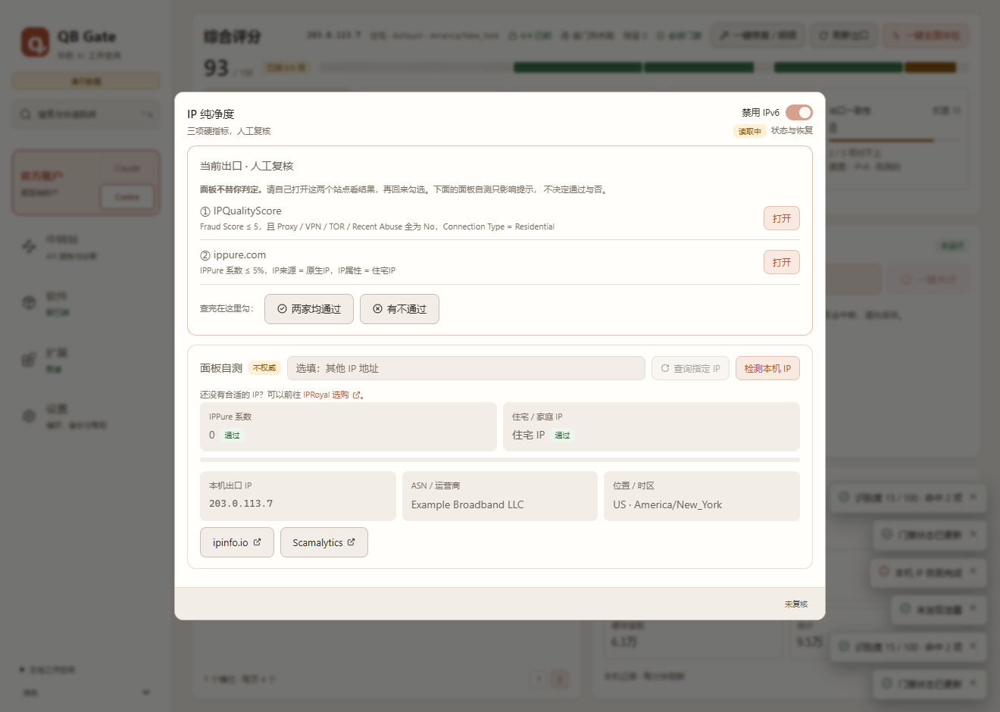
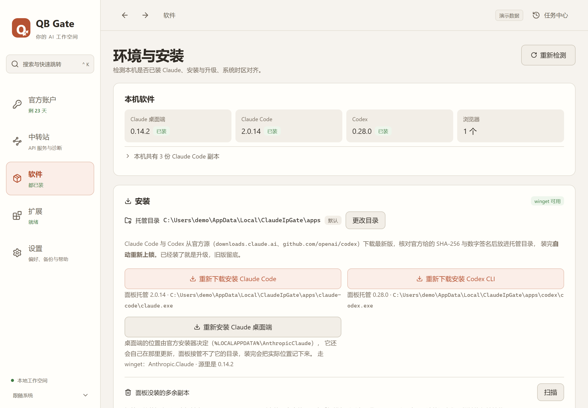
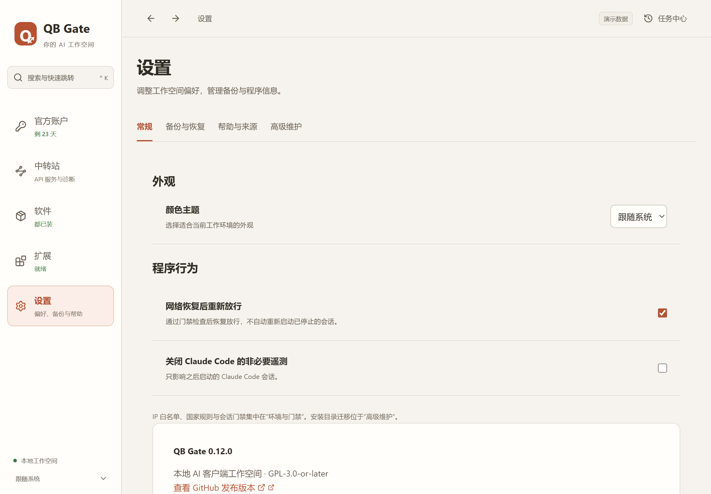

# QB Gate

有些工作需要频繁变动 IP。出口一变，电脑上还开着的 AI 软件不会跟着停下来 —— 它会继续从一个你没确认过的网络出口发请求。QB Gate 把这件事交回你自己管：只在你认可的网络出口下，允许本机的 AI 软件运行。

[](https://github.com/smithtaylor7748-ops/qb-gate/releases/latest/download/QB-Gate-Windows-x64-setup.exe)

适用于 Windows 10 / 11 x64。安装包暂未做代码签名，Windows 可能弹出 SmartScreen 提示；下载后可以对照 [Releases](https://github.com/smithtaylor7748-ops/qb-gate/releases/latest) 页面里的 `SHA256SUMS.txt` 核对哈希。

| | |
|---|---|
|  |  |
| **官方账户**：评分、门禁、账户槽位与启动 | **IP 纯净度**：人工复核与面板自测 |
|  |  |
| **软件**：托管安装、升级回滚与卸载 | **设置**：程序行为与启动时对齐 |

截图里全是演示数据，不是任何真实机器的状态。

## 怎么解决

核心是一道 IP 门禁：出口 IP 不在你的白名单里，AI 软件就启动不了；运行中 IP 变了或查不到，立即上锁并关闭受管会话。下面按侧栏菜单简单介绍。

### 官方账户

侧栏里分 Claude 与 Codex 桌面端两边。

- **综合评分**：IP 纯净度、DNS 泄露、中文环境、IP 锁、出口一致性五项检测，一键全面体检，点任一格在小窗里就地处理。IP 纯净度里的「禁用本机 IPv6」默认开启。
- **门禁**：IP 白名单（可加国家规则）配合执行锁，白名单之外的出口 IP 起不了 Claude；看门狗在放行期间每 15–20 秒复核一次，不合格或查不到就上锁并关闭受管会话；会话内门禁（每次请求前再验一次）默认关闭。
- **账户槽位**：新建、切换、删除你本人的登录槽位；显示套餐、凭证剩余天数、5 小时与 7 天额度和 token 用量（只读本机文件）；检查官方目录里残留的 API 配置。
- **启动与关闭**：验过出口 IP 再启动 Claude Code、Claude 桌面端、酒馆；一键关闭所有 Claude。
- **Codex 桌面端**：官方登录槽位、手动切换、本机用量。

### 中转站

- 智能调度（内测中：界面里已经出现，但目前还不能正常使用）。

### 软件

- **托管安装**：Claude Code、Codex CLI 从官方源下载，核对 SHA-256 与数字签名后装进托管目录，装完自动上锁；Claude 桌面端可重新安装。
- **升级与回滚**：可选最新版或稳定版，旧版本收进版本库（最多 3 份），随时回滚。
- **门禁范围**：Claude 的执行锁始终开启；Codex 可以选择纳入 IP 门禁（默认关闭）。
- **清理与卸载**：扫描面板之外的多余副本；完全卸载先只读盘点，手动输入「卸载」才执行；另附给其他 AI 用的卸载提示词。
- **Google Chrome**：隐私审计（只读）、修改系统代理、浏览器出站锁（都是点了才执行、可以撤销），以及完全卸载（会删除全部浏览器数据）。

### 扩展

- **酒馆（SillyTavern）**：接入你自己安装的酒馆，自动定位安装位置，管理桥接、启停、角色资产与备份。
- **MCP、Skills、配置模板**：导入并预览差异后装进指定环境，连接测试由你手动发起。

### 设置

- **常规**：外观主题；网络恢复后重新放行；关闭 Claude Code 非必要遥测；启动时按出口 IP 对齐系统时区与区域格式（默认开启）、显示语言（默认关闭）。
- **备份与恢复**：创建与恢复配置快照。
- **帮助与来源**：新手引导、许可与第三方来源、问题反馈、发行版本。
- **高级维护**：更改托管目录、恢复系统时区。

## 免责声明

使用前请完整阅读 [免责声明 DISCLAIMER.md](DISCLAIMER.md)。要点：

- 非官方项目，与 Anthropic、OpenAI 等任何服务商都没有隶属、合作或背书关系。
- **不对账户状态作任何承诺。** 本软件只管住你本机的 AI 软件，不改写设备指纹、不伪装账户身份，不为绕过、规避任何服务商的安全措施、合规要求、地区限制或封禁而设计，也做不到。
- 不含代理、VPN 或翻墙功能。网络接入是否合法，由使用者自行负责。
- 只能用于你本人合法拥有的账户，并遵守所在地法律与各服务商条款。账户切换只能手动触发，同一时刻只有一个账户激活；不联网查额度（额度读数只来自本机文件，仅用于显示），也没有按限流、429 或额度自动换号的路径。
- 部分功能会修改系统设置（IPv6、时区与区域格式、防火墙规则、系统代理等）或永久删除数据，执行前请看清提示。

## QQ 群

「门禁值班室」：`1109462206`

使用问题、装不上、功能建议都可以来群里聊。贴日志和截图之前，先把出口 IP、账户邮箱、Token 打码。

## 许可证

本项目按 **AGPL-3.0-only** 发布，完整条款见 [LICENSE](LICENSE)。

### 授权声明

**这一段才是正式声明**，`Cargo.toml` / `package.json` 里的 license 字段只是给包管理器
看的提示，不构成授权。注意措辞里**没有**「或任何更新版本」—— 本项目按 AGPL **第 3 版**
授权，不自动适用 FSF 将来发布的新版本（AGPL 第 14 节）。

```
QB Gate — Windows 本地 AI 客户端工作空间
Copyright (C) 2026 smithtaylor7748-ops

This program is free software: you can redistribute it and/or modify
it under the terms of the GNU Affero General Public License as published
by the Free Software Foundation, version 3.

This program is distributed in the hope that it will be useful,
but WITHOUT ANY WARRANTY; without even the implied warranty of
MERCHANTABILITY or FITNESS FOR A PARTICULAR PURPOSE.  See the
GNU Affero General Public License for more details.

You should have received a copy of the GNU Affero General Public License
along with this program.  If not, see <https://www.gnu.org/licenses/>.
```

## 社区

本项目在 [LINUX DO](https://linux.do/) 社区进行开源推广，感谢社区佬友的交流、反馈与建议。
