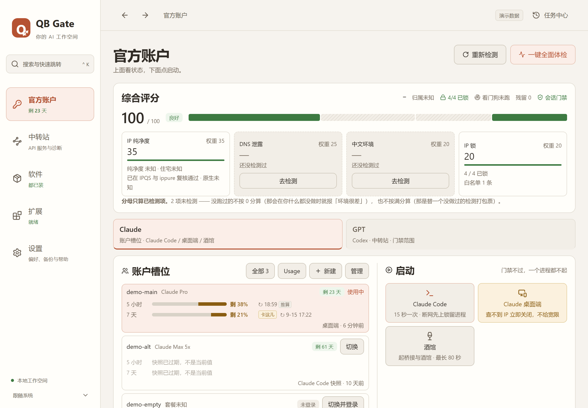
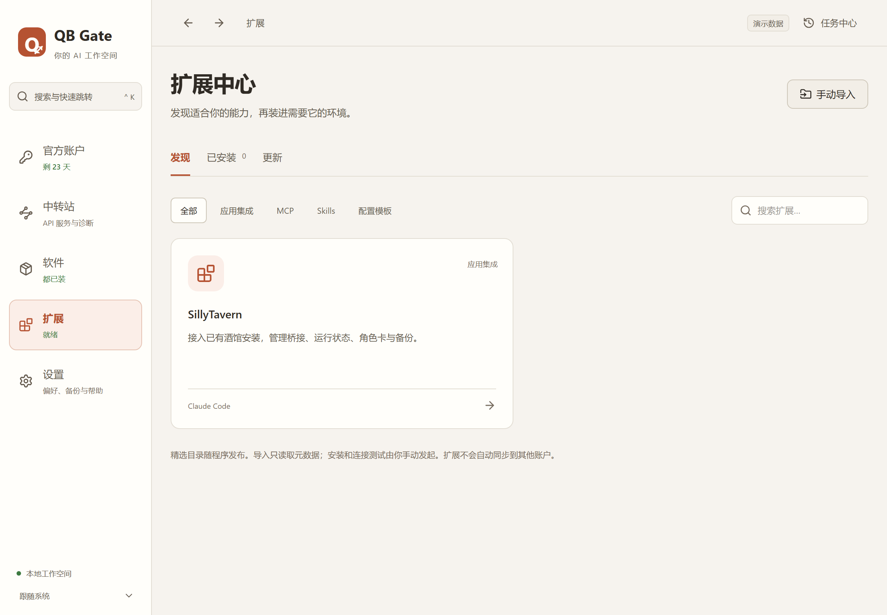

# QB Gate

Windows 上的本地 AI 客户端工作空间：管理官方账户，独立启动中转环境，按环境安装扩展。

[](https://github.com/smithtaylor7748-ops/qb-gate/actions/workflows/ci.yml)
[](LICENSE)



## 三个核心能力

- **官方账户工作台**：管理本人持有的 Claude 登录槽位，关联桌面端资料，启动官方 Claude Code、Claude Desktop 和 Codex。槽位横条显示五小时与七天窗口的剩余额度和恢复时刻。
- **中转站管理与诊断**：服务商 → API 凭证 → 使用环境。每个中转环境有独立配置目录，支持 Claude Code 与 Codex，与官方会话同时运行。
- **多类型扩展中心**：应用集成、MCP、Skills、配置模板。发现、已安装和更新分开；酒馆只在它自己的详情页中管理。

中转站是客户端 API 配置和诊断工具，不运行本地 API 网关，不提供计费、代理或 VPN 服务。官方账户不会自动轮换。

用量读自官方客户端写在本机的文件（槽位的 `.claude.json` 与桌面端的 `plan-usage-history.json`），**不发网络请求、不调用任何额度接口**，且只用于显示 —— 面板不据此做任何决定，不存在按额度自动切换身份的路径。

## 下载与安装

到 [GitHub Releases](https://github.com/smithtaylor7748-ops/qb-gate/releases) 下载与源码标签匹配的 `QB Gate_<版本>_x64-setup.exe`。支持 Windows 10 / 11 x64，需要 WebView2 Runtime。发行包尚未配置代码签名，下载后可核对同一 Release 的 `SHA256SUMS.txt`。

```powershell
Get-FileHash '.\QB Gate_0.12.1_x64-setup.exe' -Algorithm SHA256
```

默认按当前 Windows 用户安装。早期名称为 **ClaudeGate**；如机器同时存在 ClaudeGate 与 QB Gate，先退出旧面板，再从 Windows“已安装的应用”卸载旧名称。运行期数据位于 `%LOCALAPPDATA%\ClaudeIpGate`，不是程序安装目录。不要手动删除该数据目录来更新程序。

本项目与 Anthropic、OpenAI 或扩展上游没有隶属关系。使用前请阅读 [免责声明](DISCLAIMER.md) 与 [已知限制](docs/KNOWN-ISSUES.zh-CN.md)。

## 从哪里开始

| 导航 | 用途 |
|---|---|
| 工作台 | 分别启动官方与中转客户端、查看会话、保存启动方案、紧急关闭受管会话 |
| 官方账户 | 登录槽位、手动切换、桌面端资料关联、历史 API 配置迁移预览 |
| 中转站 | 服务商、凭证、环境、模型、配置差异与回滚、连接诊断 |
| 扩展中心 | 发现、已安装、更新、导入 Skills 或 MCP、接入已有酒馆 |
| 环境与门禁 | 检测覆盖情况、网络与环境证据、软件安装和版本、门禁规则 |
| 设置 | 外观、程序偏好、备份恢复、来源和帮助 |

按 `Ctrl+K` 搜索功能、账户、服务商和扩展。页面使用地址路由，支持返回；筛选与未保存草稿保存在当前面板会话中。长任务可在任务中心查看，网络诊断和 MCP 连接测试支持取消。

### 官方账户

新建槽位后，在官方客户端中完成原生登录。切换官方账户前，面板核验并关闭相关官方进程；无法枚举、无法确认进程身份、关闭失败或退出超时都会阻断切换。中转进程按独立会话归属管理。

官方 Codex 使用自己的原生登录目录，不属于 Claude 槽位。Claude Desktop 当前只支持官方启动。发现官方目录包含 API 端点或 Key 时，先到“官方账户 → 历史 API 配置”查看迁移差异；确认后建立独立中转环境。OAuth 凭证不会复制进数据库或配置快照。

### 中转站

1. 添加服务商名称和 HTTP(S) API 基础地址。
2. 添加一把或多把 API 凭证。编辑时明确选择“保留、替换、清除”。
3. 创建使用环境，选择客户端、凭证、模型和协议。
4. 预览并应用配置，或从工作台直接启动。外部修改会阻断直接启动，需先重新预览。

Claude Code 环境设置独立 `CLAUDE_CONFIG_DIR`；Codex 环境设置独立 `CODEX_HOME`，限定 API 认证和文件凭证存储。密钥在 Windows 上由 DPAPI 加密存储，仅对子进程注入对应变量，不修改系统环境变量。配置更改不重新注入已运行进程；新配置在下次启动生效。

诊断由用户发起。默认检查连接与模型列表；实际模型调用、流式响应和工具调用需主动勾选，可能产生 API 费用。地址末尾有无 `/v1` 都会统一处理。401、404、超时、无模型输出、流式中断分别报告；响应头只作为来源线索，不把缺少某个头当成伪造证据。

导出默认不含 Key。导入后需要重新填写凭证。删除服务商、凭证或环境前会检查引用关系。配置预览绑定文件内容和修订号，预览后发生变化会要求重新检查。

### 扩展



目录默认只列 SillyTavern 集成；其余条目（Filesystem MCP、Git MCP、Skill Creator、Web App Testing、Claude Code 与 Codex 中转模板）装过之后才出现在列表里，也可以用全局搜索直接打开。手动导入不受此限制。

- **应用集成**：先在详情填写已有安装的位置，再接入；管理桥接、启动、停止、角色资产和备份。解除接入保留原应用与数据。
- **MCP**：导入 stdio 或 HTTP 配置，填写变量，选择官方或中转环境，预览后启用。连接测试会运行所选命令或连接所填服务，仅初始化并读取工具能力。
- **Skills**：扫描本地目录或 GitHub 仓库的 `SKILL.md`，固定来源版本，预览文件差异后安装。导入阶段不执行仓库脚本。更新遇到用户修改会停止；卸载将文件移入保留数据目录。
- **模板**：填写服务商、凭证与模型，生成独立中转使用环境。

每个扩展只写入所选环境。清单收录不是安全认证；执行 MCP 程序和使用第三方 Skills 前应检查来源与内容。具体许可与固定版本在详情页和 [来源清单](ATTRIBUTION.md) 中列出。

### 门禁与会话

执行锁使用 Windows ACL；网络判断共用一个判定器。巡检间隔为 15 秒，另有检测与关停耗时；无法确认 IP 时立即发起关停，没有宽限期。退出受管面板会终止使用 Job Object 绑定的受门禁会话；最小化到托盘会继续运行。未纳入门禁的 Codex 会话不使用退出即终止策略。

官方和中转的身份配置隔离，但同一 Claude 程序的执行锁是共同的。停止某个会话只处理该会话；紧急关闭处理全部受管会话，并保持门禁关闭。检测与执行锁不构成强制网络隔离，已发出的请求无法撤回。

## 数据、恢复与升级

v0.12.0 首次启动先检查恢复日志，再把旧 JSON 数据备份并迁入 SQLite。无法解密的旧 Key 标为待填写；旧的“账户 + 中转”档案拆成独立启动方案。不会自动清除无法确认归属的官方目录配置。

外部配置使用“读取校验 → 备份 → 暂存 → 替换 → 验证 → 提交”流程。SQLite 事务与文件日志共同记录提交决定。恢复失败时显示恢复页面，保留错误原因与原日志，并阻止普通写操作；仍提供重试和应急移除执行锁。

快照包括配置与内部元数据，不包括官方 OAuth、软件二进制或全部扩展资产；恢复不会更改安装根目录。软件迁移、版本回滚、酒馆资产备份走各自入口。参见 [迁移说明](docs/MIGRATION-0.12.zh-CN.md)。

## 从源码构建

需要 Windows x64、Node.js 24、Rust stable（最低 1.88）、MSVC C++ Build Tools 与 Windows SDK。普通构建无需 Python；酒馆和部分扩展各有依赖。

```powershell
npm ci
npm run release:check
npm test
npm run types:check
npm run build
cargo test --locked --manifest-path src-tauri/Cargo.toml
npm run test:ui
npm run tauri build
```

安装包输出：`target/release/bundle/nsis/`（Cargo workspace 的 target 在仓库根）。`npm run demo` 用虚构账户和保留地址展示界面，不调用本机 Tauri 命令；截图由演示模式生成，不包含真实凭证。

锁文件纳入版本控制。`npm run types:generate` 从 Rust 导出前端类型；`npm run licenses:generate` 更新依赖清单与许可声明。CI 在 Windows runner 上执行源码检查、格式检查、类型检查、前后端测试和界面回归。Release 工作流额外验证标签版本并生成安装包与哈希。

## 开发与反馈

请先读 [CLAUDE.md](CLAUDE.md)、[架构](docs/ARCHITECTURE.zh-CN.md)、[已知限制](docs/KNOWN-ISSUES.zh-CN.md) 与 [贡献说明](CONTRIBUTING.md)。报告问题时附版本、复现步骤和脱敏日志，不上传数据库、快照、OAuth 文件、API Key 或个人安装路径。

项目采用 **GPL-3.0-or-later**。依赖及外部扩展保留各自许可证。见 [LICENSE](LICENSE)、[ATTRIBUTION.md](ATTRIBUTION.md)、[依赖清单](docs/dependencies.json) 和 [完整第三方声明](THIRD_PARTY_NOTICES.txt)。
