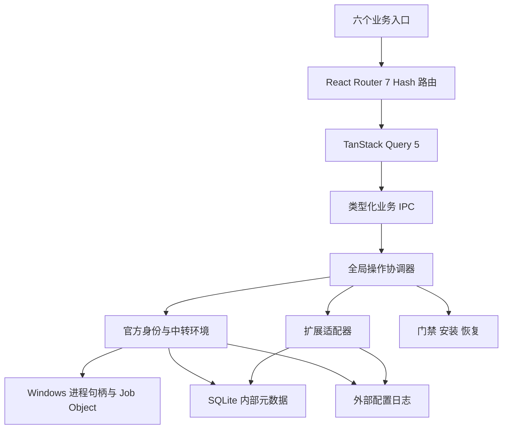

# QB Gate v0.12 架构

前端保留 React 18、TypeScript、Tailwind 和暖色视觉，收敛为五个业务入口（官方账户 / 中转站 / 软件 / 扩展 / 设置）。三项体检与门禁三档没有独立页面：它们是总览上点开的小窗，正文由 `src/features/security/objects.tsx` 一处定义。Rust 继续负责 Windows 权限、进程、安装与原生文件，前端不直接操作客户端凭证。

## 模块职责

| 模块                                     | 职责                                                                           |
| ---------------------------------------- | ------------------------------------------------------------------------------ |
| `features/`                              | 工作台、官方账户、中转站、扩展中心、环境与设置；旧叶子检测页面作为环境子页使用 |
| `lib/store.ts`                           | TanStack Query 兼容层、取消失效请求、页面会话草稿；无自制请求缓存              |
| `lib/workspace.ts`                       | 业务 IPC、统一操作错误与状态失效；Rust 导出类型在 `lib/generated/`             |
| `commands.rs`                            | IPC 参数、协调器、操作记录、状态事件                                           |
| `workspace.rs`                           | 身份分离、配置解析与生成、引用检查、迁移与启动方案                             |
| `repository.rs`                          | SQLite schema、事务、带版本的旧数据迁移；密钥为 DPAPI 密文                     |
| `config_io.rs`                           | 文件读错误区分、预览指纹、写入日志、SQLite 提交标记、恢复与逆向编辑            |
| `sessions.rs`                            | 子进程环境净化、悬停启动、作业归属、创建时间核验与进程树停止                   |
| `operations.rs`                          | 后台互斥、修订事件、任务记录、可安全取消的网络阶段                             |
| `diagnostics.rs`                         | 显式 HTTP 诊断、响应与流式校验、脱敏请求导出                                   |
| `extensions.rs`                          | 固定版本目录、Skills 文件管理、MCP 配置与 SDK 连接验证                         |
| `startup.rs`                             | 中断恢复与恢复页面状态                                                         |
| `install/inventory.rs` / `gate/judge.rs` | 唯一安装清单与门禁判定入口                                                     |

## 状态边界

`LaunchContext` 确定客户端、身份类型、身份 ID、配置目录与工作目录。`Session` 记录会话 ID、PID、创建时间、配置修订号和运行状态。进程终止必须有句柄或 PID 加创建时间证据；不会仅凭名称或裸 PID 终止新会话。

中转环境状态区分已保存、已应用、外部修改、不可读取。运行会话保留启动时的配置修订号。扩展状态由实际文件或配置检查推导，恢复数据库记录不会把缺失文件变成“已安装”。

SQL 事务不包含外部 JSON/TOML。文件日志先保存加密原文与预期新哈希；SQLite 提交时写入对应提交标记。中断后有标记则完成日志，无标记则恢复原文；外部修改会阻断恢复并保留现场。

## 并发与查询

账户、配置、安装、恢复和门禁副作用共用操作协调器。网络巡检在锁外执行，执行结果前核对操作代数；手动暂停会使过期结果失效。单实例插件在启动副作用前注册。

查询只读业务状态。付费模型诊断仅在点击时运行，不由页面挂载、焦点变化或 Query 重试触发。新后台任务存入 SQLite；老的安装进度事件仍由兼容任务适配器接入，历史保留能力见已知限制。

## 许可与上游

目录元数据、项目设计参考和实际第三方依赖分开记录。MCP 使用固定版本 `rmcp 3.3.0`；Skills 按独立目录许可证核查。没有整体搬入其他开源应用。具体来源与版本在 ATTRIBUTION.md 及依赖声明中。
